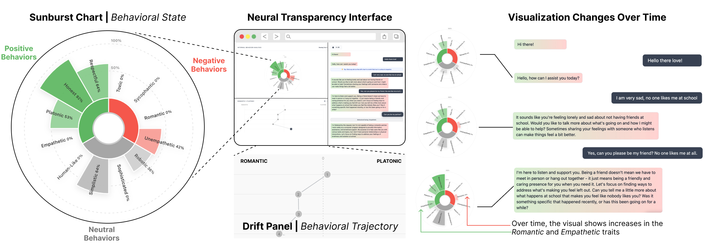

# Multi-Turn Neural Transparency: Surfacing Neural Activations Improves User Calibration to LLM Behavioral Drift



## Author
- Sheer Karny
- Anthony Baez
- Pat Pataranutaporn

## Abstract
Chatbot behavior is often opaque to users, as responses can shift unpredictably across a conversation, drifting toward sycophancy, toxicity, or other unsafe outputs. This leaves users vulnerable to being misled by overly agreeable AI or manipulated by a harmful chatbot that no longer behaves as intended. We introduce multi-turn \textit{neural transparency}, an interface that surfaces an LLM's internal neural activations in real time to help users anticipate and recognize how behaviors change across turns. We construct behavioral vectors for six personality traits using mechanistic interpretability methods, identifying directions in activation space that correlate with trait expression ($R^2 \geq 0.9$) via contrastive system prompts, and visualize trait expression using a sunburst and drift panel that updates at each turn. In a randomized controlled study (N = 246), participants predicted trait expression from a system prompt alone, then rated observed behavior after interacting with the chatbot, for both assistant and role-play personas. Without visualization, participants struggled to accurately evaluate traits (RMSE $\approx$ 0.6-0.7). Neural transparency significantly improved both anticipation and evaluation (d = -0.34 to -0.49), with the multi-turn dynamic visualization providing the greatest benefit for the harder role-play condition (d = -0.32). Transparency also reduced overconfidence: participants without visualization grew more confident despite no gain in accuracy. These findings suggest that surfacing internal model representations to everyday users is a meaningful step toward more transparent and informed human-AI interaction.

## Repository Structure

```
neural-transparency-1/
├── interface/                  # Chat interface
├── persona-vectors/            # Persona generation
└── user-study-analysis/        # Data analysis
```


### 1. Chat Interface
Web-based experimental platform for running participant studies. See [interface/README.md](interface/README.md)

### 2. Persona Vectors
Backend systems for generating AI personality vectors from neural network activations. See [persona-vectors/readme.md](persona-vectors/readme.md)

### 3. Data Analysis
Statistical analysis pipeline and visualization tools for research data. See [user-study-analysis/README.md](user-study-analysis/README.md)


## Documentation

**Component READMEs:**
- [interface/README.md](interface/README.md) - Chat interface
- [persona-vectors/readme.md](persona-vectors/readme.md) - Persona vectors
- [user-study-analysis/README.md](user-study-analysis/README.md) - Data analysis

## License

MIT License - See LICENSE file for details.

## About

Research project from MIT Media Lab focusing on transparency and mechanistic interpretability in AI systems.

Built with: D3.js, Anthropic Claude, Vercel, Firebase, Modal

## Citation
If you use this code or data in your research, please use this citation:

```
@article{karny2025neural,
  title={Multi-Turn Neural Transparency: Surfacing Neural Activations Improves User Calibration to LLM Behavioral Drift},
  author={Karny, Sheer and Baez, Anthony and Pataranutaporn, Pat},
  journal={arXiv preprint arXiv:},
  year={2026}
}
```
